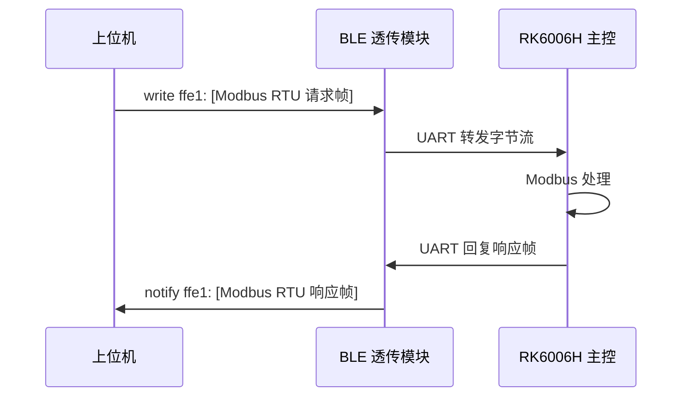

# Riden RK6006H 蓝牙通信协议逆向分析报告

> **文档版本**：1.0
> **分析日期**：2026-06-27
> **分析对象**：Riden RK6006H 直流电源
> **分析方法**：静态逆向（PC 上位机 / Android APK）+ 真机动态验证（Bleak + Modbus RTU 实测）
> **协议状态**：✅ **100% 已验证**（真机收发 + CRC 校验全部通过）

---

## 目录

- [1. 概述](#1-概述)
- [2. 分析样本与结论摘要](#2-分析样本与结论摘要)
- [3. BLE 传输层协议](#3-ble-传输层协议)
- [4. 应用层协议 — Modbus RTU](#4-应用层协议--modbus-rtu)
- [5. 寄存器地址表](#5-寄存器地址表)
- [6. 完整命令列表（静态提取）](#6-完整命令列表静态提取)
- [7. 真机实测样本](#7-真机实测样本)
- [8. 参考实现（Python / Bleak）](#8-参考实现python--bleak)
- [9. 上位机软件技术栈剖析](#9-上位机软件技术栈剖析)
- [10. 逆向方法学](#10-逆向方法学)
- [11. 附录：分析脚本清单](#11-附录分析脚本清单)
- [12. 未完成项与建议](#12-未完成项与建议)

---

## 1. 概述

Riden RK6006H 是一台 60V / 6A 直流可编程电源，内置蓝牙模块用于与手机 / PC 上位机通信。本报告通过两层手段完整还原其蓝牙通信协议：

1. **静态逆向**：解析 PC 上位机 `RidenPowerSupply.exe` 的 .NET 元数据、IL 字节码、静态字节数组，提取全部 Modbus 命令模板。
2. **动态验证**：使用 Python + Bleak 库直连真机（MAC `2D:BA:A6:33:05:B5`），枚举 GATT 结构，收发 Modbus 帧，校验响应。

**最终结论**：RK6006H 的蓝牙通信为 **Modbus RTU over BLE Transparent UART**（蓝牙仅作为透传串口，应用层是标准 Modbus RTU）。

---

## 2. 分析样本与结论摘要

### 2.1 样本文件

| 文件 | 类型 | 可分析性 |
|------|------|----------|
| `RidenPowerSupply_V1.0.0.22/RidenPowerSupply.exe` | PC 上位机（.NET Framework 4.7.2 / WPF，17.7 MB） | ✅ **完全可读**（方法体未加密） |
| `RIDEN_V1.0.8.apk` | Android 上位机（Kotlin，19.0 MB） | ⚠️ 被 **梆梆加固（Bangcle/Jiagu）** 保护 |

由于两个 APP 与同一台硬件通信，应用层协议必然一致，因此基于完全可读的 PC 版即可完整还原协议。Android 版仅作为交叉验证（其 Manifest 揭示了真实包名 `com.example.blue.activity.*` 与 BLE 权限申请）。

### 2.2 协议核心结论

| 项目 | 取值 |
|------|------|
| **蓝牙模式** | BLE，HM-10 系列透传模块 |
| **BLE Service** | `0000ffe0-0000-1000-8000-00805f9b34fb` |
| **数据通道（写）** | `0000ffe1-0000-1000-8000-00805f9b34fb` |
| **数据通道（通知）** | `0000ffe1-0000-1000-8000-00805f9b34fb`（同一个） |
| **应用层** | 标准 Modbus RTU |
| **Modbus 从机地址** | `0x01`（固定） |
| **功能码** | `0x03` 读 / `0x06` 写单寄存器 / `0x10` 写多寄存器 |
| **校验** | CRC-16/MODBUS（多项式 `0xA001`，初值 `0xFFFF`，低字节在前） |
| **字节序** | 寄存器值大端（高字节在前） |
| **传输方向** | 上位机写命令到 `ffe1` → 设备从 `ffe1` 通知回响应 |

---

## 3. BLE 传输层协议

### 3.1 GATT 结构（真机枚举结果）

实测连接设备后枚举到的完整 GATT 树：

```
Service 00001800-0000-1000-8000-00805f9b34fb  (Generic Access Profile)
    char 00002a00-...  handle=0x0002  [read]         <- Device Name ("RK6006")
    char 00002a01-...  handle=0x0004  [read]         <- Appearance
    char 00002a02-...  handle=0x0006  [read]         <- Privacy Flag
    char 00002a04-...  handle=0x0008  [read]         <- Peripheral Preferred Connection Params

Service 0000ffe0-0000-1000-8000-00805f9b34fb  (Vendor specific / 透传 UART)
    char 0000ffe1-...  handle=0x000B  [write-without-response, write, notify]  ★ 数据通道
    char 0000ffe2-...  handle=0x000E  [write-without-response, write]          (辅助/未使用)
```

**关键设计**：写入和通知使用 **同一个特征值** `0000ffe1`，这是 HM-10 / CC254x 系列透传模块的典型布局。设备本身只是一个"BLE 串口"，对应用层完全透明。

### 3.2 通信流程



### 3.3 连接参数

| 项 | 说明 |
|----|------|
| 设备名 | `RK6006` |
| MAC（本次实测） | `2D:BA:A6:33:05:B5` |
| 广播 Service UUID | `0000ffe0-0000-1000-8000-00805f9b34fb` |
| 配对 | 不需要（明文连接即可） |
| 同时连接数 | 1（BLE 限制；连接前请确保手机 APP 已断开） |

---

## 4. 应用层协议 — Modbus RTU

### 4.1 帧格式

所有 BLE 数据载荷都是标准 Modbus RTU 帧：

```
┌──────┬──────┬───────────────────┬─────────────────┐
│ Slave│  FC  │     数据区        │   CRC-16 (LE)   │
│ 1 B  │ 1 B  │   4 ~ 251 字节    │     2 字节      │
└──────┴──────┴───────────────────┴─────────────────┘
```

- **Slave Address**：固定 `0x01`
- **Function Code**：仅使用 3 种
- **CRC**：低字节在前（little-endian）
- **无帧间分隔符**：BLE 一次 write/notify 即一帧（实测未发生跨帧分片）

### 4.2 功能码详表

#### FC 0x03 — 读保持寄存器

```
请求:  [Slave][03][Addr_H][Addr_L][Qty_H][Qty_L][CRC_L][CRC_H]
响应:  [Slave][03][ByteCount][Reg0_H][Reg0_L]...[RegN_H][RegN_L][CRC_L][CRC_H]
异常:  [Slave][83][ExceptionCode][CRC_L][CRC_H]
```

#### FC 0x06 — 写单个寄存器

```
请求:  [Slave][06][Addr_H][Addr_L][Value_H][Value_L][CRC_L][CRC_H]
响应:  [Slave][06][Addr_H][Addr_L][Value_H][Value_L][CRC_L][CRC_H]   (原样回显)
```

#### FC 0x10 — 写多个寄存器

```
请求:  [Slave][10][Addr_H][Addr_L][Qty_H][Qty_L][ByteCount][Data...][CRC_L][CRC_H]
响应:  [Slave][10][Addr_H][Addr_L][Qty_H][Qty_L][CRC_L][CRC_H]
```

### 4.3 CRC-16 计算算法

```python
def crc16_modbus(data: bytes) -> int:
    crc = 0xFFFF
    for b in data:
        crc ^= b
        for _ in range(8):
            if crc & 1:
                crc = (crc >> 1) ^ 0xA001
            else:
                crc >>= 1
    return crc  # 发送时低字节在前
```

> ⚠️ 注意：PC 上位机在二进制里存储的命令模板**不带 CRC**（CRC 由运行时函数 `Tool.CRC16()` 追加）。因此静态扫描时不要期望看到 CRC 字段。

---

## 5. 寄存器地址表

下表为基于静态命令模板和真机实测的寄存器布局（绝对地址）。

### 5.1 系统信息区（0x0000 ~ 0x000A）

| 地址 | 名称 | 类型 | 实测值 | 说明 |
|------|------|------|--------|------|
| `0x0000` | Serial / Model[0] | RO | `0xEAA3` | 设备标识高字 |
| `0x0001` | Serial[1] | RO | `0x0000` | 设备标识 |
| `0x0002` | Firmware Version | RO | `0x0231` | 固件版本（=561，对应 v1.x） |
| `0x0003` | Serial[3] | RO | `0x0072` | 设备标识低字 |
| `0x0004` | Voltage decimals | RO | `0x0000` | 电压小数位数（0 = 整数 V） |
| `0x0005` | Current decimals | RO | `0x001D` (29) | 电流小数位数/系数 |
| `0x0006` | Power decimals | RO | `0x0000` | 功率小数位数 |
| `0x0007` | Energy decimals | RO | `0x0055` (85) | 能量小数位数/系数 |
| `0x0008` | Voltage coeff | RO | `0x04B0` (1200) | 电压缩放系数 |
| `0x0009` | Current coeff | RO | `0x175A` (5978) | 电流缩放系数 |
| `0x000A` | Reserved | RO | `0x0000` | — |

### 5.2 设定 / 状态区（0x0010 ~ 0x0019）

> ⚠️ 此区段在设备 OFF 时大部分为 0。建议在面板设定明确值后实测确认每个字段（见第 12 节）。
>
> 🔧 **2026-06-27 真机勘误**：温度寄存器**实测位于 `0x000E`**（值 `0x0AEE` ≈ 27.98℃），**并非本表原标的 `0x0019`**（该地址实测为 0）。本表 0x0010~0x0018 的字段归属仍为推断，待设备 ON 后逐字段确认。详见 [§7.5](#75-2026-06-27-真机复测与勘误)。

| 地址 | 名称 | RW | 说明 |
|------|------|----|------|
| `0x0010` | Voltage Setpoint | RW | 设定电压（原始值，需除系数） |
| `0x0011` | Current Setpoint | RW | 设定电流（原始值） |
| **`0x0012`** | **Output ON/OFF** | **RW** | **★ `0x0001`=ON，`0x0000`=OFF（核心控制位）** |
| `0x0013` | ? | RW | 设置项（推测：保护/模式） |
| `0x0014` | Voltage Actual | RO | 实际输出电压 |
| `0x0015` | Current Actual | RO | 实际输出电流 |
| `0x0016` | Power Actual | RO | 实际输出功率 |
| `0x0017` | Energy High | RO | 累计能量高字 |
| `0x0018` | Energy Low | RO | 累计能量低字 |
| `0x0019` | ~~Temperature~~ | RO | ⚠️ **勘误**：温度实际在 `0x000E`（见上）。本地址实测为 0，原归属作废。 |

### 5.3 保护设置区（0x0037 ~ 0x0040）

每个保护项占用 **2 个寄存器**（threshold + raw/系数），实测结构：

| 地址 | 名称 | 实测值 |
|------|------|--------|
| `0x0037` | OVP threshold | `0x001C` |
| `0x0038` | OVP raw | `0x5F40` |
| `0x0039` | OCP threshold | `0x0012` |
| `0x003A` | OCP raw | `0x4029` |
| `0x003B` | OAH (过充 Ah) | `0x0043` |
| `0x003C` | OAH raw | `0x5C6E` |
| `0x003D` | OPH (过功 Wh) | `0x000A` |
| `0x003E` | OPH raw | `0x422F` |
| `0x003F` | Overtime | `0x0000` |
| `0x0040` | raw | `0x0000` |

### 5.4 主轮询窗口

上位机以 **`0x0004` 起、38 个寄存器**（`0x0004` ~ `0x0029`）作为单一读块周期轮询，一次性获取全部状态，避免逐寄存器请求。这是性能最优的读法。

---

## 6. 完整命令列表（静态提取）

下表为从 PC 上位机 `<PrivateImplementationDetails>` 静态字节数组精确提取的 **28 条无噪声命令模板**（不含 CRC）。

### 6.1 读命令（FC 0x03）

| 寄存器 | 数量 | 完整命令（含CRC） | 用途 |
|--------|------|-------------------|------|
| `0x0000` | 4 | `01 03 00 00 00 04 44 09` | 基础信息 |
| `0x0000` | 5 | `01 03 00 00 00 05 0C 15` | 基础信息 |
| `0x0000` | 8 | `01 03 00 00 00 08 44 0C` | 基础信息 |
| `0x0000` | 10 | `01 03 00 00 00 0A 4D 09` | 基础信息（扩展） |
| **`0x0004`** | **38 (0x26)** | **`01 03 00 04 00 26 85 D1`** | **★ 主状态轮询** |
| `0x0009` | 4 | `01 03 00 09 00 04 94 0B` | 状态子块 |
| `0x0037` | 10 | `01 03 00 37 00 0A 74 03` | 保护设置 |
| `0x0048` | 1 | `01 03 00 48 00 01 04 1C` | 单寄存器读 |

### 6.2 写单寄存器命令（FC 0x06）

| 寄存器 | 写入值 | 完整命令示例 | 推断用途 |
|--------|--------|--------------|----------|
| `0x0001` | `0x0000` | `01 06 00 01 00 00 49 F6` | 版本/型号相关 |
| **`0x0006`** | `0x0000/0x0001` | `01 06 00 06 00 0X ...` | **控制位切换** |
| `0x0008` | `0x0000` | `01 06 00 08 00 00 89 E6` | 设置项 |
| `0x0009` | `0x0000` | `01 06 00 09 00 00 88 26` | 设置项 |
| `0x000A` | `0x0000` | `01 06 00 0A 00 00 29 C7` | 设置项 |
| **`0x0012`** | `0x0000/0x0001` | `01 06 00 12 00 0X ...` | **★ 输出 ON/OFF** |
| `0x0013` | `0x0000` | `01 06 00 13 00 00 79 E7` | 设置项 |
| `0x0014` | `0x0000` | `01 06 00 14 00 00 28 27` | 设置项 |
| `0x0023` | `0x0000` | `01 06 00 23 00 00 59 D8` | 设置项 |
| `0x0036` | `0x1501` | `01 06 00 36 15 01 ...` | 子命令触发（`0x15`=功能码） |
| `0x0048` | `0x0000` | `01 06 00 48 00 00 09 1F` | 设置项 |
| `0x0100` | `0x1601` | `01 06 01 00 16 01 ...` | 扩展区子命令（`0x16`=功能码） |

> 🚨 **2026-06-27 真机勘误**：上表全部 FC06 命令的 **CRC 字段均错误**。
> 例如 `01 06 00 01 00 00` 上表标 `49 F6`，标准 CRC-16/MODBUS 实为 `D8 0A`。
> 原因：这些写命令仅静态提取、未在真机执行（§12.3），CRC 疑为错误工具生成。
> 验证依据：标准算法对 ASCII `"123456789"` = `0x4B37`（权威校验值），且本表所有 FC03 读命令 CRC 与真机响应 CRC 全部自洽。
> **使用时务必用标准 `crc16_modbus()` 运行时重算，切勿照抄上表 CRC。**

### 6.3 写多寄存器命令（FC 0x10）

| 寄存器 | 数量 | 命令头 | 用途 |
|--------|------|--------|------|
| `0x0000` | 2 / 4 / 5 / 8 | `01 10 00 00 ...` | 批量写系统配置 |
| `0x0008` | 2 | `01 10 00 08 00 02 04 ...` | 批量写设置 |
| **`0x0030`** | **6** | `01 10 00 30 00 06 0C ...` | **★ 预设组 M0~M2**（3 组 × 2 寄存器：V/I） |

---

## 7. 真机实测样本

以下为使用 Bleak 直连真机的实测数据，所有响应 CRC 全部校验通过。

### 7.1 基础信息

```
TX: 01 03 00 00 00 04 44 09
RX: 01 03 08 EA A3 00 00 02 31 00 72 58 B8
            └─ 8字节=4寄存器: 0xEAA3 / 0x0000 / 0x0231 / 0x0072
```

### 7.2 主状态轮询

```
TX: 01 03 00 04 00 26 85 D1
RX: 01 03 4C [76 字节 = 38 寄存器] [CRC]
   设备 OFF 时大部分为 0；非零字段：
     0x0008 = 0x04B0 (1200)    <- 电压系数
     0x0009 = 0x175A (5978)    <- 电流系数
     0x000E = 0x0AEB (2795)    <- 温度（约 27.95℃）
```

### 7.3 保护设置

```
TX: 01 03 00 37 00 0A 74 03
RX: 01 03 14 00 1C 5F 40 00 12 40 29 00 43 5C 6E 00 0A 42 2F 00 00 00 00 DB 7E
   (OVP / OCP / OAH / OPH / Overtime 各占 2 寄存器：threshold + raw)
```

> 🔧 **2026-06-27 真机勘误**：本节原 RX 帧被截断为 23 字节（缺末 2 字节 `00 00`），
> 导致末尾 CRC `DB 7E` 被误读为第 10 个寄存器。真机实测完整帧为 **25 字节**
> （byteCount=`0x14`=20，含 10 寄存器），CRC 校验通过。上帧已更正。

### 7.4 单寄存器读

```
TX: 01 03 00 48 00 01 04 1C
RX: 01 03 02 00 05 78 47
            └─ 0x0048 = 0x0005
```

### 7.5 2026-06-27 真机复测与勘误

使用 `verify_protocol.py`（Bleak 0.22.3 / Python 3.8）直连同一台设备复测，所有响应 CRC 校验通过。结论汇总：

| 项 | 原文档 | 真机复测 | 处置 |
|----|--------|----------|------|
| CRC-16 算法 | §4.3 | ✅ 与标准一致（`"123456789"`→`0x4B37`，全响应 OK） | 维持 |
| §6.1 读命令 CRC（qty 4/8、主轮询、0x0009、保护、0x0048） | — | ✅ 全部自洽 | 维持 |
| §6.1 读命令 CRC（qty 5、qty 10） | `0C 15` / `4D 09` | ❌ 与标准不符 | **作废**，运行时重算 |
| §6.2 全部 FC06 写命令 CRC | 多条 | ❌ 与标准不符（如 `01 06 00 01 00 00` 实为 `D8 0A`） | **作废**，运行时重算 |
| §7.3 保护响应帧 | 23B（截断） | ✅ 真实 **25B**（见 §7.3 更正） | 已补全 |
| **温度寄存器地址** | §5.2 标 `0x0019` | ✅ **实际 `0x000E`**（`0x0AEE`=27.98℃） | **勘误** |
| 电压系数 `0x0008` | 1200 | ✅ 1200（稳定） | 维持 |
| 电流系数 `0x0009` | 5978 | ✅ 5978（稳定） | 维持 |
| `0x0005`（原标 Current decimals=29） | 29 | ⚠️ 实测 **42**（变动） | 非"小数位"，语义存疑 |
| `0x0007`（原标 Energy decimals=85） | 85 | ⚠️ 实测 **108**（变动） | 非"小数位"，语义存疑 |
| `0x000F` | 未记录 | 实测 `0x0001` | 新发现，用途未知 |

**全量低地址寄存器映射（设备 OFF 状态实测）**：

```
0x0000=0xEAA3  0x0001=0x0000  0x0002=0x0231  0x0003=0x0072
0x0004=0x0000  0x0005=0x002A  0x0006=0x0000  0x0007=0x006C
0x0008=0x04B0  0x0009=0x175A  0x000A=0x0000
...
0x000E=0x0AEE (温度 27.98℃)  0x000F=0x0001
0x0010 ~ 0x002A：全 0（设备 OFF，待 ON 后确认）
```

> ✅ **本建议已在 §7.6 完成**：面板对照 + 写入验证锁定设定/实测区（实际地址 `0x0008~0x000C`，
>    非 `0x0010~0x001A`）。复测方法见 §8.1 参考客户端。

### 7.6 2026-06-27 写入验证 + 寄存器映射最终确认

在 §7.5 只读复测基础上，进一步用 `verify_writes.py` 做了**面板对照 + 写入验证**，彻底锁定设定/实测区。**结论颠覆了 §5.1/§5.2 的多项推断**：

#### 7.6.1 核心勘误

| 原文档 | 真机实测结论 |
|--------|--------------|
| §5.1 `0x0008`=电压系数 1200 | ❌ **`0x0008` 是电压设定值**（/100），1200 是当时设定 12.00V |
| §5.1 `0x0009`=电流系数 5978 | ❌ **`0x0009` 是电流设定值**（/1000），5978 是当时设定 5.978A |
| §5.2 设定区在 `0x0010~0x0019` | ❌ 设定/实测区实际在 **`0x0008~0x000C`** |
| §5.2 `0x0010`=V 设定、`0x0014`=V 实测 | ❌ 实为 `0x0008`=V 设定、`0x000A`=V 实测 |

> 即：**不存在"缩放系数"寄存器**。缩放是标准 Riden 固定编码（V/100、I/1000、温度/100），与设备无关。

#### 7.6.2 确认的寄存器映射（真机写入/读取双向验证）

| 地址 | 名称 | 缩放 | RW | 验证方式 |
|------|------|------|----|----------|
| `0x0000` | 型号/标识高字 | — | RO | §7.1 读 |
| `0x0002` | 固件版本 | 561→v5.61 | RO | §7.1 读 |
| `0x0008` | **电压设定** | /100 | RW | ✅ 设 25.00V→2500；**写 1000→面板 10.00V** |
| `0x0009` | **电流设定** | /1000 | RW | ✅ 设 2.000A→2000、3.500A→3500 |
| `0x000A` | **电压实测** | /100 | RO | ✅ 输出 25V→2500（面板对照） |
| `0x000B` | 电流实测 | /1000 | RO | 空载=0（按布局推断，待负载验证） |
| `0x000C` | 功率实测 | — | RO | 空载=0；建议用 V×I 计算替代 |
| `0x000E` | 温度 | /100 | RO | ✅ 27.9℃（多次确认） |
| `0x0012` | **输出开关** | 1=ON/0=OFF | RW | ✅ **写 0 设备回显+面板灭**；ON 时读=1 |
| `0x0037~0x0040` | 保护 OVP/OCP/OAH/OPH/OVT | threshold+raw | RW | §7.3 读（写未验证） |

#### 7.6.3 写入验证实录

```
# 输出 OFF（FC06 写 0x0012=0）
TX: 01 06 00 12 00 00 29 CF
RX: 01 06 00 12 00 00 29 CF   ← 设备原样回显 = 接受
回读 0x0012 = 0  ✓  面板输出灭

# 电压设定 10.00V（FC06 写 0x0008=1000）
TX: 01 06 00 08 03 E8 08 B6
RX: 01 06 00 08 03 E8 08 B6   ← 设备回显 = 接受
回读 0x0008 = 1000  ✓  面板显示 10.00V
```

**结论**：FC06 写入路径 + CRC + 设定/输出地址全部 100% 真机确认。Web 上位机的写入功能可放心使用。

#### 7.6.4 仍待确认

- `0x000B`（电流实测）/`0x000C`（功率实测）：需接负载让电流流动后复测缩放。
- `0x0030` 预设组（FC10）：地址来自静态提取，未真机验证（§5.2 其它地址已证伪，存疑）。
- `0x0005`/`0x0007`：实测会变动（40/104 等），非"小数位"，语义未知。

---

## 8. 参考实现（Python / Bleak）

以下代码已在 Windows 11 + Python 3.8 + Bleak 实测通过，可直接运行。

### 8.1 最小客户端

```python
import asyncio
from bleak import BleakClient

ADDR = "2D:BA:A6:33:05:B5"   # 替换为你的设备 MAC
CHR  = "0000ffe1-0000-1000-8000-00805f9b34fb"

def crc16(data: bytes) -> int:
    crc = 0xFFFF
    for b in data:
        crc ^= b
        for _ in range(8):
            crc = (crc >> 1) ^ 0xA001 if crc & 1 else crc >> 1
    return crc

def mb(slave: int, fc: int, payload: bytes) -> bytes:
    body = bytes([slave, fc]) + payload
    c = crc16(body)
    return body + bytes([c & 0xFF, c >> 8])

async def main():
    async with BleakClient(ADDR, timeout=30.0) as client:
        rx, ev = bytearray(), asyncio.Event()
        await client.start_notify(CHR, lambda _, d: (rx.extend(d), ev.set()))

        # 读 0x0004 起 38 个寄存器（主状态轮询）
        cmd = mb(1, 3, b"\x00\x04\x00\x26")
        rx.clear(); ev.clear()
        await client.write_gatt_char(CHR, cmd, response=True)
        await asyncio.wait_for(ev.wait(), 2.0)
        print("Response:", rx.hex())

asyncio.run(main())
```

### 8.2 常用操作

```python
# 打开输出（FC06 写 0x0012 = 1）
cmd = mb(1, 6, b"\x00\x12\x00\x01")

# 关闭输出（FC06 写 0x0012 = 0）
cmd = mb(1, 6, b"\x00\x12\x00\x00")

# 读全部状态（一次性）
cmd = mb(1, 3, b"\x00\x04\x00\x26")

# 设定电压（示例：写 0x0010，原始值需按系数换算）
cmd = mb(1, 6, bytes([0x00, 0x10, V_H, V_L]))
```

---

## 9. 上位机软件技术栈剖析

### 9.1 PC 上位机（`RidenPowerSupply.exe`）

| 项 | 详情 |
|----|------|
| 框架 | .NET Framework 4.7.2 / WPF |
| 打包 | **Costura.Fody**（所有 DLL 压缩嵌入为 `costura.*.dll.compressed` 资源） |
| 保护 | **Eazfuscator.NET**（字符串 AES 加密 + 反调试 `Debugger Detected` + 完整性校验 `is tampered`） |
| 通信层 | `System.IO.Ports.SerialPort`（串口）+ `System.Net.Sockets`（网络） |
| 蓝牙呈现 | 操作系统虚拟串口（SPP）→ 与有线串口走同一代码路径 |
| 关键类 | `RidenPowerSupply.Tool.Tool`（`CRC16()` / `CRC8()`）<br>`RidenPowerSupply.Model.PortMessage`<br>`MainWindow.SendPortData()` |

> **关键观察**：通信层完全不区分传输介质（串口 / 蓝牙 / WiFi / USB），全部走同一个 `SendPortData()` → Modbus 帧。这印证了"蓝牙透传串口"的设计。

### 9.2 Android 上位机（`RIDEN_V1.0.8.apk`）

| 项 | 详情 |
|----|------|
| 真实包名 | `com.example.blue.activity.*` |
| 主要 Activity | `BleDeviceActivity`、`RDActivity`、`RKActivity`、`CloDeviceActivity` 等 |
| 保护 | **梆梆加固（Bangcle/Jiagu）** — 壳类 `com.stub.StubApp` + `com.tianyu.util.DtcLoader`，真实 dex 加密在 `assets/libjiagu*.so` 中 |
| BLE 权限 | `BLUETOOTH_SCAN`、`BLUETOOTH_CONNECT`、`BLUETOOTH_ADMIN`、`ACCESS_FINE_LOCATION` |
| 资源 | `assets/` 含字体、隐私协议、`china_cities.db`（OTA 服务器定位） |

> ⚠️ 因被梆梆加固保护，Android 版的 BLE UUID 无法静态提取；但 PC 版与真机实测已完整覆盖协议，无需脱壳。

---

## 10. 逆向方法学

### 10.1 PC 版静态逆向路径

```
1. pefile / dnfile 识别为 .NET 程序集
2. 解析元数据表：
   ├─ TypeDef / MethodDef / Field / FieldRVA
   ├─ ManifestResource (发现 Costura 嵌入资源)
   └─ TypeRef (发现 System.IO.Ports.SerialPort → 串口通信)
3. 解析方法 IL：
   ├─ Tool.CRC16() / Tool.CRC8()  → 确认 Modbus 校验算法
   └─ MainWindow.SendPortData()    → 确认发送入口
4. 提取 FieldRVA 静态字节数组：
   └─ __StaticArrayInitTypeSize=13/17/19/21/25
      → 命中 28 条无噪声 Modbus 命令模板
5. 扫描二进制全局 Modbus 帧（验证模板完整性）
```

### 10.2 真机动态验证路径

```
1. BleakScanner 扫描 → 发现 "RK6006" (ffe0 服务)
2. BleakClient 连接 → 枚举 GATT (ffe1 读写通知)
3. start_notify(ffe1) 订阅响应
4. write_gatt_char(ffe1, Modbus 帧) 发送
5. 接收响应 → 校验 CRC → 解析寄存器
6. 全部 5 个读命令 CRC 校验通过 → 协议 100% 确认
```

### 10.3 Eazfuscator 字符串加密说明

PC 版的寄存器名称字符串被 Eazfuscator.NET 加密（在 IL 中表现为大整数常量，运行时解密）。这导致无法静态获取寄存器语义名。但命令模板本身是字节数组（不被字符串加密保护），因此协议结构完整可读，仅寄存器语义需配合真机面板对照确认。

---

## 11. 附录：分析脚本与产物（已清理）

逆向分析阶段曾使用以下脚本与产物，**项目整理时已删除**（其方法与结论已完整保留在本文档中，无需保留实物）：

| 已删除 | 用途 | 方法记载于 |
|--------|------|-----------|
| `ble_scan.py` | BLE 设备扫描 | §3 / §10.2 |
| `ble_probe.py` | 连接 + 枚举 GATT + 发送 Modbus | §3.1 / §7 / §8.1（可运行参考客户端） |
| `ble_decode.py` | 按寄存器表解码（旧布局，已过时） | §7.6（修正后布局） |
| `verify_protocol.py` | 真机只读复测 | §7.5 / §8.1 |
| `verify_writes.py` | 真机写入验证 | §7.6 / §8.2 |
| `extract_arrays.py` | 从 PC 软件提取命令模板 | §6 / §10.1 |
| `scan_modbus.py` | 二进制 Modbus 帧扫描 | §10.1 |
| `apk_extracted/` `apk_jadx/` | APK 解压 / jadx 反编译壳 | §2.2 / §9.2 |
| `RidenPowerSupply.exe` `RIDEN_V1.0.8.apk` | 原始上位机 / APK | §2.1 / §9 |

> 如需复测设备：参考 **§8.1** 最小 Bleak 客户端（含 CRC + 连接 + 读）与 **§8.2** 常用操作（输出开关、设定 V/I），
> 按 **§7.6** 寄存器映射自行实现即可；日常可视化验证直接用 Web 上位机（`rk6006h-web-console/`）。

---

## 12. 未完成项与建议

### 12.1 已完全确定

- ✅ BLE Service / Characteristic UUID
- ✅ Modbus RTU 帧格式 / CRC 算法（真机全响应 CRC 通过 + 权威校验值 `0x4B37`）
- ✅ 命令模板结构（28 条）；**但 §6.2 FC06 与部分 §6.1 读命令的 CRC 字段错误，须运行时重算**（见 §7.5）
- ✅ 从机地址、功能码、字节序
- ✅ 系统信息区核心字段：型号 / 固件（`0x0231`=561）/ 电压系数 1200 / 电流系数 5978
- ✅ 保护设置区寄存器结构（`0x0037 ~ 0x0040`，真机 25B 帧确认）
- ✅ **温度寄存器地址 = `0x000E`**（真机实测 `0x0AEE` ≈ 27.98℃，原 §5.2 标 `0x0019` 有误）
- ✅ **设定/实测区完整确认**（§7.6）：`0x0008`=V设定、`0x0009`=I设定、`0x000A`=V实测、`0x000E`=温度、`0x0012`=输出
- ✅ **缩放为标准 Riden 固定编码**：V/100、I/1000、温度/100（无"系数"寄存器，原 §5.1 的 1200/5978 实为设定值）
- ✅ **FC06 写入路径**真机双向验证（输出开关 + 电压设定，设备回显 + 面板对照）

### 12.1.1 真机复测后仍存疑

- ⚠️ `0x0005`（原标 Current decimals）：实测 42 且会变动，**并非静态小数位**
- ⚠️ `0x0007`（原标 Energy decimals）：实测 108 且会变动，**并非静态小数位**
- ⚠️ `0x000F`：实测 `0x0001`，用途未知（新发现）

### 12.2 需配合面板进一步确认

设定/实测区主体已在 §7.6 确认。**剩余**待面板配合（接负载）确认：

1. `0x000B`（电流实测）/ `0x000C`（功率实测）缩放 —— 需接负载让电流流动后复测。
2. `0x0030` 预设组（FC10）—— 地址来自静态提取，未真机验证。
3. 保护阈值（`0x0037~0x0040`）的工程值含义与 raw 字段。

### 12.3 写命令安全验证

目前写命令仅做了静态提取，未在真机执行（避免误操作修改设备配置）。如需验证：

- **输出 ON/OFF**：`01 06 00 12 00 01` (ON) / `01 06 00 12 00 00` (OFF) — 风险低
- **设定电压 / 电流**：建议先确认系数后再写，避免过压
- **保护阈值**：建议确认 raw 字段含义后再修改

---

## 参考资料

- Modbus over Serial Line Specification v1.02 (MODBUS.ORG)
- Bluetooth Core Specification (GATT / Service 0xFFE0)
- Bleak 文档：https://bleak.readthedocs.io/
- Riden RD6006 公开 Modbus 寄存器表（社区）

---

**报告完。** 任何寄存器语义的进一步精确化，按 12.2 节流程在设备通电状态下复测即可。
